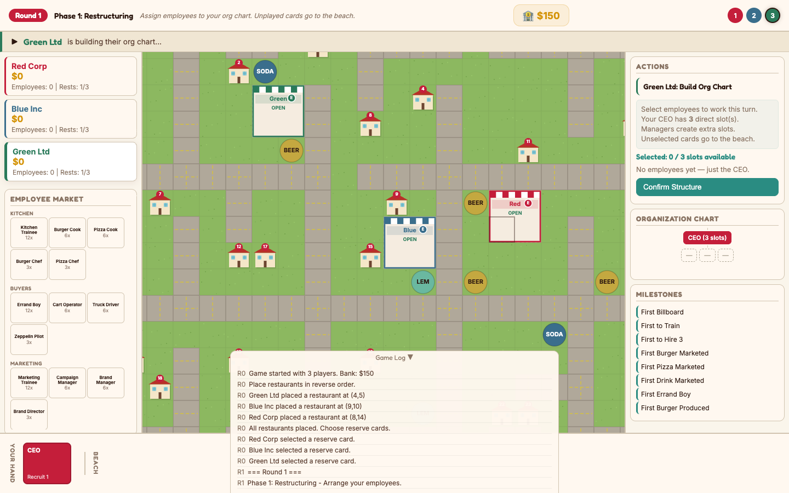
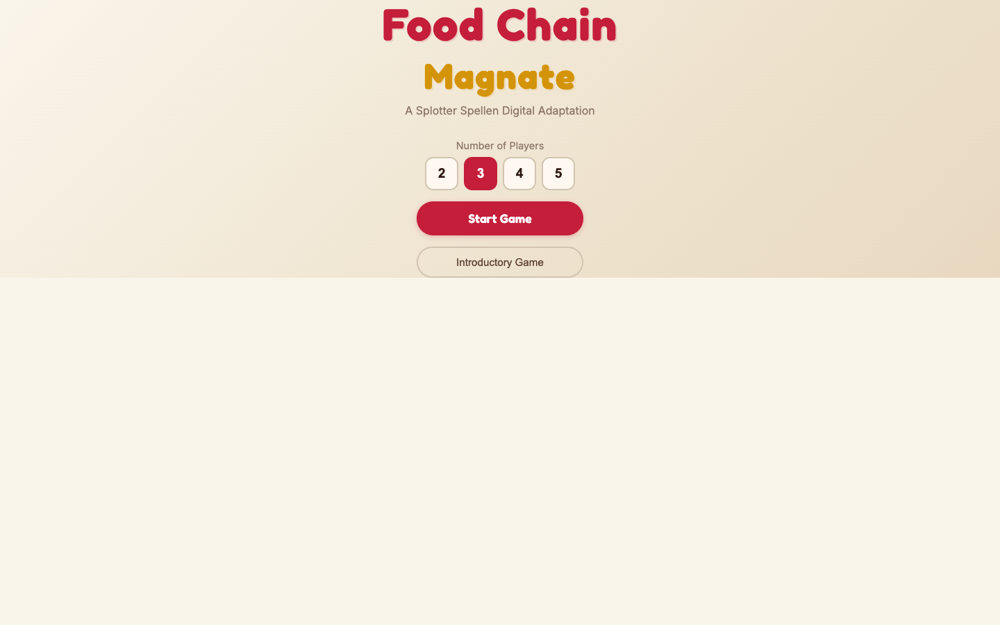
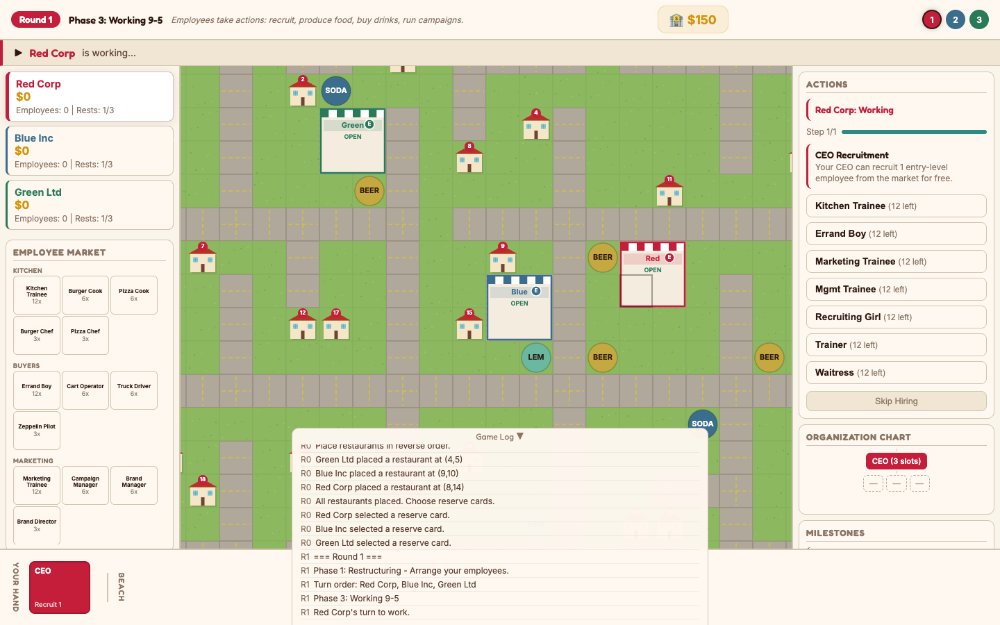

# Food Chain Magnate — Digital Edition

A browser-based digital adaptation of the board game *Food Chain Magnate* by Splotter Spellen, featuring a warm 1950s retro diner aesthetic.



## How to Play

```bash
python3 -m http.server 8080
# Open http://localhost:8080
```

No build step required — pure HTML, CSS, and JavaScript.

## Features

- **2–5 player hot-seat multiplayer**
- **Complete rule implementation** — all 7 phases, 30+ employee types, 19 milestones
- **Procedurally generated maps** from 20 tile templates with road connectivity
- **Full economic loop** — production, marketing, demand, sales, salaries
- **Introductory variant** for learning the game (no milestones, simplified bank)
- **Retro diner theme** — warm cream/red/teal palette with Fredoka display font
- **Clear gameplay flow** — current player banner, phase descriptions, transition overlays, progress bars

## Screenshots

| Menu | Working Phase |
|------|--------------|
|  |  |

## Game Overview

Players build fast-food empires on a shared city map by hiring staff, producing food and drinks, running marketing campaigns, and selling to houses. The game ends when the bank runs out of money twice. Most cash wins.

### Turn Structure

| Phase | Name | Description |
|-------|------|-------------|
| 1 | Restructuring | Assign employees to your org chart |
| 2 | Order of Business | Determine turn order by open slots |
| 3 | Working 9–5 | Activate employees: recruit, train, produce, market |
| 4 | Dinnertime | Houses buy from the cheapest nearby restaurant |
| 5 | Payday | Pay salaries or fire employees |
| 6 | Marketing | Active campaigns generate demand on houses |
| 7 | Cleanup | Discard unsold goods, return cards to hand |

### Employee Types

- **Kitchen** — Kitchen Trainee → Burger/Pizza Cook → Burger/Pizza Chef
- **Buyers** — Errand Boy → Cart Operator → Truck Driver → Zeppelin Pilot
- **Marketing** — Marketing Trainee → Campaign Manager → Brand Manager → Brand Director
- **Management** — Management Trainee → Junior VP → Senior VP → Executive VP
- **Pricing** — Pricing Manager, Discount Manager, Luxuries Manager
- **Special** — CFO, New Business Developer, Local/Regional Manager
- **Recruiting** — Recruiting Girl → Recruiting Manager → HR Director
- **Training** — Trainer → Coach → Guru
- **Service** — Waitress

## Project Structure

```
index.html      — Single-page app shell with Google Fonts
style.css       — 1950s retro diner theme (cream/red/teal palette)
constants.js    — Employee definitions, milestones, phase descriptions
map.js          — Procedural map generation and pathfinding
engine.js       — Game state machine and rules engine
renderer.js     — Canvas board renderer (48px cells, warm visuals)
ui.js           — Interactive UI with phase overlays and progress tracking
main.js         — Entry point, menu, and board interaction
screenshots/    — Game screenshots
```

## Credits

*Food Chain Magnate* is designed by Jeroen Doumen & Joris Wiersinga, published by Splotter Spellen (2015). This is an unofficial fan-made digital adaptation for personal use.
